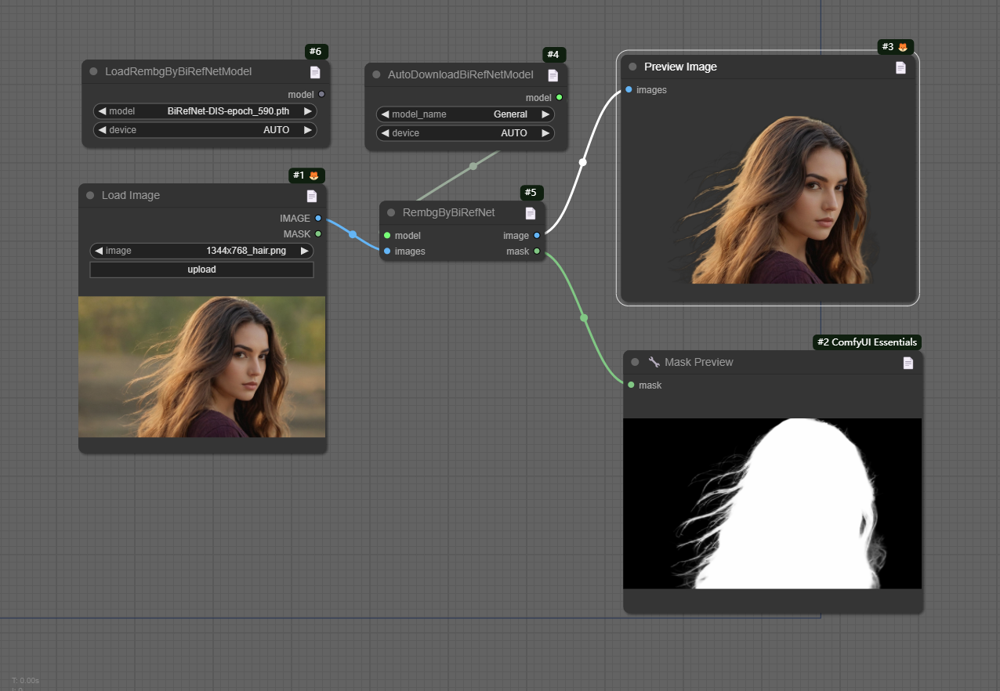

## Example


## Install

- Manual
```shell
    cd custom_nodes
    git clone https://github.com/lldacing/ComfyUI_BiRefNet_ll.git
    cd ComfyUI_BiRefNet_ll
    pip install -r requirements.txt
    # restart ComfyUI
```
    

## Models

The available models are:

- General: A pre-trained model for general use cases.
- General-Lite: A light pre-trained model for general use cases.
- Portrait: A pre-trained model for human portraits.
- DIS: A pre-trained model for dichotomous image segmentation (DIS).
- HRSOD: A pre-trained model for high-resolution salient object detection (HRSOD).
- COD: A pre-trained model for concealed object detection (COD).
- DIS-TR_TEs: A pre-trained model with massive dataset.

Model files go here (when use AutoDownloadBiRefNetModel automatically downloaded if the folder is not present during first run): `models/BiRefNet`.  

If necessary, they can be downloaded from:
- [General](https://huggingface.co/ZhengPeng7/BiRefNet/resolve/main/model.safetensors) ➔ `model.safetensors` must be renamed `General.safetensors`
- [General-Lite](https://huggingface.co/ZhengPeng7/BiRefNet_T/resolve/main/model.safetensors) ➔ `model.safetensors` must be renamed `General-Lite.safetensors`
- [Portrait](https://huggingface.co/ZhengPeng7/BiRefNet-portrait/resolve/main/model.safetensors) ➔ `model.safetensors` must be renamed `Portrait.safetensors`
- [DIS](https://huggingface.co/ZhengPeng7/BiRefNet-DIS5K/resolve/main/model.safetensors) ➔ `model.safetensors` must be renamed `DIS.safetensors`
- [HRSOD](https://huggingface.co/ZhengPeng7/BiRefNet-HRSOD/resolve/main/model.safetensors) ➔ `model.safetensors` must be renamed `HRSOD.safetensors`
- [COD](https://huggingface.co/ZhengPeng7/BiRefNet-COD/resolve/main/model.safetensors) ➔ `model.safetensors` must be renamed `COD.safetensors`
- [DIS-TR_TEs](https://huggingface.co/ZhengPeng7/BiRefNet-DIS5K-TR_TEs/resolve/main/model.safetensors) ➔ `model.safetensors` must be renamed `DIS-TR_TEs.safetensors`


## Nodes
- AutoDownloadBiRefNetModel
  - Automatically download the model into models/BiRefNet
- LoadRembgByBiRefNetModel
  - Can select model from "models/BiRefNet" or the path of "birefnet" configured in the extra YAML file
  - You can download model from [BiRefNet Releases](https://github.com/ZhengPeng7/BiRefNet/releases)
- RembgByBiRefNet

## Thanks

[BiRefNet](https://github.com/zhengpeng7/birefnet)

[dimitribarbot/sd-webui-birefnet](https://github.com/dimitribarbot/sd-webui-birefnet)

