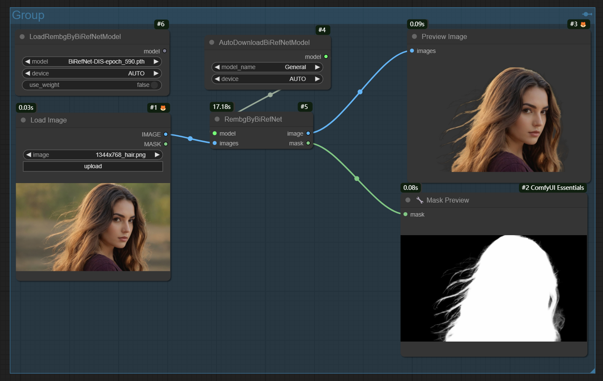

[English](README.md)

支持使用新老版本BiRefNet模型进行抠图

## 预览



## 安装

- 手动安装
```shell
    cd custom_nodes
    git clone https://github.com/lldacing/ComfyUI_BiRefNet_ll.git
    cd ComfyUI_BiRefNet_ll
    pip install -r requirements.txt
    # restart ComfyUI
```
- ComfyUI管理器搜索安装
    

## 模型

### 最新的模型:

- General: 用于一般用例的预训练模型。
- General-HR: 用于一般用例的预训练模型，在更高分辨率的图像上表现出色(训练分辨率2048x2048)。
- General-Lite: 用于一般用例的轻量级预训练模型。
- General-Lite-2K: 用于一般用例的轻量级预训练模型，适用于高分辨率图像(最佳分辨率2560x1440)。
- General-dynamic: 用于动态分辨率的预训练模型，基于256x256到2304x2304的图片分辨率进行训练。
- General-reso_512: 一个更快、更准确的低分辨率预训练模型，基于512x512的图像训练。
- General-legacy: 一般用例的预训练模型，基于DIS5K-TR,DIS-TEs, DUTS-TR_TE,HRSOD-TR_TE,UHRSD-TR_TE, HRS10K-TR_TE (w/o portrait seg data)。
- Portrait: 人物肖像预训练模型。
- Matting: 一种使用无过渡遮罩抠图的预训练模型。
- Matting-HR: 在更高分辨率的图像上显示出出色的性能的预训练模型 (2048x2048)。
- Matting-Lite: 用一般用例的无过渡遮罩抠图的轻量级预训练模型。
- DIS: 一种用于二分图像分割（DIS）的预训练模型。
- HRSOD: 一种用于高分辨率显著目标检测（HRSOD）的预训练模型。
- COD: 一种用于隐蔽目标检测（COD）的预训练模型。
- DIS-TR_TEs: 具有大量数据集的预训练模型。

模型文件放在`${comfyui_rootpath}/models/BiRefNet`（当使用AutoDownloadBiRefNetModel时，则会自动下载模型）。

也可以手动下载模型:
- [General](https://huggingface.co/ZhengPeng7/BiRefNet/resolve/main/model.safetensors) ➔ `model.safetensors` 重命名为 `General.safetensors`
- [General-HR](https://huggingface.co/ZhengPeng7/BiRefNet_HR/resolve/main/model.safetensors) ➔ `model.safetensors` 重命名为 `General-HR.safetensors`
- [General-Lite](https://huggingface.co/ZhengPeng7/BiRefNet_T/resolve/main/model.safetensors) ➔ `model.safetensors` 重命名为 `General-Lite.safetensors`
- [General-Lite-2K](https://huggingface.co/ZhengPeng7/BiRefNet_lite-2K/resolve/main/model.safetensors) ➔ `model.safetensors` 重命名为 `General-Lite-2K.safetensors`
- [General-dynamic](https://huggingface.co/ZhengPeng7/BiRefNet_dynamic/resolve/main/model.safetensors) ➔ `model.safetensors` 重命名为 `General-dynamic.safetensors`
- [General-legacy](https://huggingface.co/ZhengPeng7/BiRefNet-legacy/resolve/main/model.safetensors) ➔ `model.safetensors` 重命名为 `General-legacy.safetensors`
- [General-reso_512](https://huggingface.co/ZhengPeng7/BiRefNet_512x512/resolve/main/model.safetensors) ➔ `model.safetensors` 重命名为 `General-reso_512.safetensors`
- [Portrait](https://huggingface.co/ZhengPeng7/BiRefNet-portrait/resolve/main/model.safetensors) ➔ `model.safetensors` 重命名为 `Portrait.safetensors`
- [Matting](https://huggingface.co/ZhengPeng7/BiRefNet-matting/resolve/main/model.safetensors) ➔ `model.safetensors` 重命名为 `Matting.safetensors`
- [Matting-HR](https://huggingface.co/ZhengPeng7/BiRefNet_HR-matting/resolve/main/model.safetensors) ➔ `model.safetensors` 重命名为 `Matting-HR.safetensors`
- [Matting-Lite](https://huggingface.co/ZhengPeng7/BiRefNet_lite-matting/resolve/main/model.safetensors) ➔ `model.safetensors` 重命名为 `Matting-Lite.safetensors`
- [DIS](https://huggingface.co/ZhengPeng7/BiRefNet-DIS5K/resolve/main/model.safetensors) ➔ `model.safetensors` 重命名为 `DIS.safetensors`
- [HRSOD](https://huggingface.co/ZhengPeng7/BiRefNet-HRSOD/resolve/main/model.safetensors) ➔ `model.safetensors` 重命名为 `HRSOD.safetensors`
- [COD](https://huggingface.co/ZhengPeng7/BiRefNet-COD/resolve/main/model.safetensors) ➔ `model.safetensors` 重命名为 `COD.safetensors`
- [DIS-TR_TEs](https://huggingface.co/ZhengPeng7/BiRefNet-DIS5K-TR_TEs/resolve/main/model.safetensors) ➔ `model.safetensors` 重命名为 `DIS-TR_TEs.safetensors`


GitHub上的模型：
[BiRefNet Releases](https://github.com/ZhengPeng7/BiRefNet/releases)

### 旧模型:
- [BiRefNet-DIS_ep580.pth](https://huggingface.co/ViperYX/BiRefNet/resolve/main/BiRefNet-DIS_ep580.pth)
- [BiRefNet-ep480.pth](https://huggingface.co/ViperYX/BiRefNet/resolve/main/BiRefNet-ep480.pth)

## 权重模型(非必须)
下载放在`models/BiRefNet`
- [swin_large_patch4_window12_384_22kto1k.pth](https://huggingface.co/ViperYX/BiRefNet/resolve/main/swin_large_patch4_window12_384_22kto1k.pth)（非General-Lite、General-Lite-2K和Matting-Lite模型）
- [swin_tiny_patch4_window7_224_22kto1k_finetune.pth](https://drive.google.com/drive/folders/1cmce_emsS8A5ha5XT2c_CZiJzlLM81ms)（仅General-Lite、General-Lite-2K和Matting-Lite模型）


## 节点
- AutoDownloadBiRefNetModel
  - 自动下载模型到 `${comfyui_rootpath}/models/BiRefNet`，不支持权重
- LoadRembgByBiRefNetModel
  - 从 `${comfyui_rootpath}/models/BiRefNet` 和 在extra YAML 文件中通过`birefnet`配置的路径中选择模型
  - 支持 [BiRefNet Releases](https://github.com/ZhengPeng7/BiRefNet/releases) 中的新模型 和 老的模型[BiRefNet-DIS_ep580.pth](https://huggingface.co/ViperYX/BiRefNet/resolve/main/BiRefNet-DIS_ep580.pth) 与 [BiRefNet-ep480.pth](https://huggingface.co/ViperYX/BiRefNet/resolve/main/BiRefNet-ep480.pth)
  - 参数use_weight设为True时, 需要下载权重模型，General-Lite、General-Lite-2K和Matting-Lite模型使用[swin_tiny_patch4_window7_224_22kto1k_finetune.pth](https://drive.google.com/drive/folders/1cmce_emsS8A5ha5XT2c_CZiJzlLM81ms)，其它模型使用 [swin_large_patch4_window12_384_22kto1k.pth](https://huggingface.co/ViperYX/BiRefNet/resolve/main/swin_large_patch4_window12_384_22kto1k.pth)  
- RembgByBiRefNet
  - 输出透明前景图和遮罩
- RembgByBiRefNetAdvanced
  - 输出前景图和遮罩，提供一些微调参数
- GetMaskByBiRefNet
  - 仅输出遮罩
- BlurFusionForegroundEstimation
  - 使用[fast-foreground-estimation](https://github.com/Photoroom/fast-foreground-estimation)方法预估前景图

## 感谢

[ZhengPeng7/BiRefNet](https://github.com/zhengpeng7/birefnet)

[dimitribarbot/sd-webui-birefnet](https://github.com/dimitribarbot/sd-webui-birefnet)

